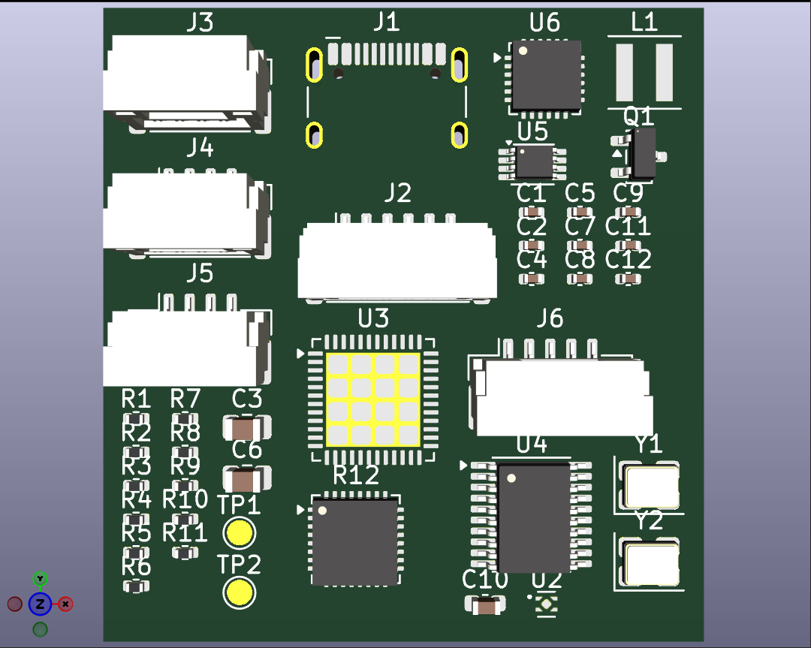

# BrakeWise Plus — Phase 1 PCB

PCB board design for **Phase 1 of the BrakeWise Plus Tool** (ATI brake tread body board), designed in KiCad.

> ⚠️ **Work in progress — not complete.**
> This board is still in the design phase. The schematic and layout are not finalized,
> have not been reviewed, and should not be sent for fabrication.

## Key components

| Ref | Part | Function |
|-----|------|----------|
| U3 | STM32U575CIUx (QFN-48) | Main microcontroller |
| U6 | CH334F (QFN-24) | USB 2.0 hub controller |
| U4 | AS5304A-ATSM (TSSOP-20) | Magnetic encoder |
| U5 | SN74LVC3G17DCUR (VSSOP-8) | Triple Schmitt-trigger buffer |
| U2 | AP2112K-3.3 | 3.3 V LDO regulator |
| — | TPS630701RNMR | Buck-boost converter (in schematic) |
| Q1 | AO3401A (SOT-23) | P-channel MOSFET |
| L1 | 1.5 µH (Coilcraft XxL4020) | Power inductor |
| J1 | USB-C receptacle (USB 2.0) | USB connection |
| J2–J6 | JST GH connectors (4/5/6-pin) | External connections |
| Y1, Y2 | 3.2 × 2.5 mm crystals (Y2: 12 MHz) | Clock sources |
| TP1, TP2 | 1.5 mm test pads | Test points |

Plus 0402/0603/0805 passives (R1–R11, C1–C12).

## Files

- `ATI_brake_tread_body.kicad_pro` — KiCad project
- `ATI_brake_tread_body.kicad_sch` — schematic
- `ATI_brake_tread_body.kicad_pcb` — board layout
- `Parts.kicad_sym` — custom symbol library
